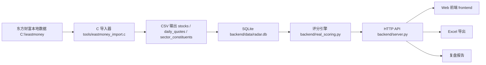
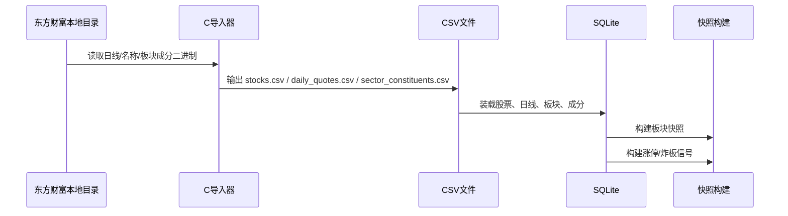
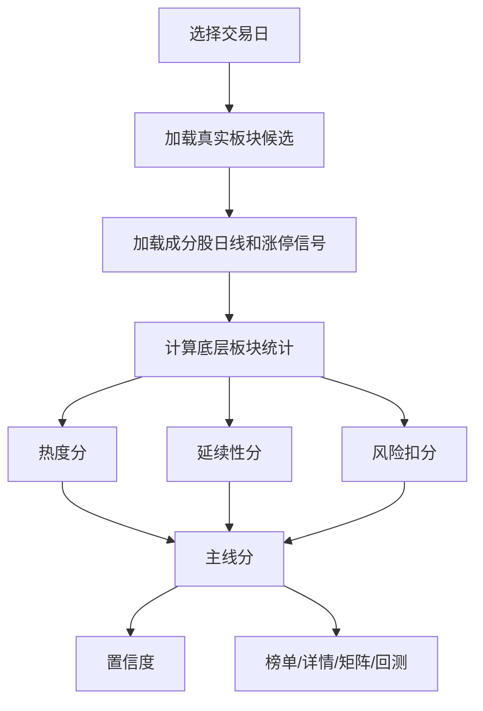

# A股板块主线雷达 软件设计说明书

| 项目 | 内容 |
| --- | --- |
| 文档版本 | v0.1 |
| 编写日期 | 2026-05-01 |
| 基准需求 | `docs/a股板块主线雷达_软件需求规格说明书_v_1.md` |
| 当前实现 | 本地 Web + Python API + SQLite + 东方财富本地数据 |
| 适用范围 | 个人本地复盘 demo、收盘评分、历史回测、Excel 导出 |

## 1. 设计目标

本设计文档描述当前 demo 版本的技术方案、模块边界、数据流、评分流程、接口设计、性能设计和后续差距。原始 SRS 文件作为需求基准保留，不在本文档中修改。

当前目标是先跑通一个可用的个人本地版本：

1. 使用东方财富本地客户端数据作为第一阶段主数据源。
2. 只实现收盘复盘和历史研究，不实现盘中实时监控。
3. 使用真实东方财富板块和成分股驱动主线榜单、详情、矩阵和成分股表。
4. 保留可解释评分、风险扣分、置信度、回测、自选股、复盘报告和 Excel 导出。
5. 后续导入 5 年数据后，页面首屏刷新目标为 100ms 内，必须依赖预计算快照和索引。

## 2. 与需求文档的主要差距

### 2.1 数据覆盖差距

当前数据库只验证了东方财富本地日线短窗口数据，日期范围约为 2026-04-01 至 2026-04-30，尚未完成 5 年历史数据导入。SRS 要求回测支持 5 年历史，且需避免未来函数。

尚未完整接入的数据包括：

- 真实舆情供应商数据。
- 龙虎榜和游资席位数据。
- 新闻自动分类和自动催化识别。
- 申万、中信、同花顺、通达信等多源板块体系。
- 指数环境的完整历史基准。

### 2.2 模型差距

当前模型已经实现热度分、延续性分、风险扣分、置信度、资金接力断裂、涨停/炸板近似、因子有效性分析等核心逻辑，但仍有差距：

- 舆情因子使用行情代理或占位字段，不是真实讨论量、搜索量、新闻提及量。
- 人工催化事件已入库展示，但尚未稳定进入热度分和延续性分。
- 自动聚合目前主要使用东方财富真实板块动态候选和轻量聚类，尚未将自动聚合结果版本化落库。
- 因子动态权重已有配置能力，但当前样本太短，统计有效性不足。
- 主线阶段识别已有状态字段，但“启动、加速、高潮、分歧、退潮、修复”的完整状态机仍需强化。

### 2.3 性能差距

用户要求导入 5 年数据后页面刷新时间 100ms 内。当前实现已经把首页首屏和慢模块拆开，避免整页被矩阵、因子、置信度历史等接口阻塞，但仍存在根本性能缺口：

- 近 20 日矩阵冷启动可能需要数十秒。
- 因子有效性和置信度历史仍可能请求时逐日重算。
- 尚未建立完整的预计算快照表。
- 尚未建立 5 年数据量下的性能回归测试。

### 2.4 产品能力差距

当前 Web 端已经实现主线榜单、详情、矩阵、回测、自选股、持仓风险、复盘报告、因子分析、置信度历史、真实板块浏览和 Excel 导出。但与 SRS 仍有差距：

- 首页主线分布图还比较基础，不是完整交互式可视化。
- 详情页舆情趋势图尚未接入真实舆情。
- 预警是页面内计算展示，尚未实现外部通知、订阅或任务调度。
- 权限是本地角色和请求头控制，尚无正式登录、用户体系和安全会话。

## 3. 总体架构

当前采用本地单机架构，便于个人使用和快速验证。



核心原则：

- 东方财富二进制 `.dat` 只由 C 程序读取。
- Python 后端只读取 C 导出的 CSV 和 SQLite。
- 原始数据、模型输出、人工操作和审计日志都尽量可追溯。
- 慢计算模块不得阻塞首页首屏渲染。

## 4. 技术栈

| 层级 | 当前选型 | 说明 |
| --- | --- | --- |
| 数据导入 | C | 读取东方财富本地二进制文件 |
| 数据装载 | Python | 将 CSV 装载到 SQLite |
| 后端 API | Python 标准库 `ThreadingHTTPServer` | 本地 demo，低依赖 |
| 存储 | SQLite | 个人本地版本优先；长期 DDL 草案保留 PostgreSQL 风格 |
| 前端 | HTML/CSS/JavaScript | 静态 Web 页面 |
| 导出 | pandas + openpyxl | Excel 导出 |
| 测试 | unittest | 本地烟测 |

## 5. 模块设计

| 模块 | 文件 | 职责 |
| --- | --- | --- |
| 东方财富导入器 | `tools/eastmoney_import.c` | 读取日线、股票名称、板块成分等本地二进制数据，输出 UTF-8 CSV |
| CSV 装载 | `backend/load_eastmoney_csv.py` | 建表、导入股票、日线、板块、成分关系，并触发快照和涨停信号构建 |
| 板块快照 | `backend/build_sector_snapshots.py` | 构建板块日度行情快照 |
| 涨停信号 | `backend/build_limit_signals.py` | 构建触板、封板、炸板、连板近似信号 |
| 评分引擎 | `backend/real_scoring.py` | 计算热度分、延续性分、风险扣分、主线分、置信度、矩阵、回测 |
| 模型配置 | `backend/model_config_store.py` | 保存和读取模型参数版本 |
| 复盘保存 | `backend/review_store.py` | 保存日度评分、风险、置信度和自然语言复盘 |
| 主线管理 | `backend/theme_store.py` | 主线、映射、自定义板块、版本历史 |
| 板块查询 | `backend/sector_store.py` | 查询东方财富真实板块和成分 |
| 自选和持仓 | `backend/watchlist_store.py` | 自选股、持仓、风险联动 |
| 催化事件 | `backend/catalyst_store.py` | 人工催化事件和等级 |
| 权限 | `backend/permissions.py` | 本地角色和权限判断 |
| 审计 | `backend/audit_store.py` | API、参数、复盘、回测和人工操作日志 |
| API 服务 | `backend/server.py` | 路由、静态文件、JSON API、Excel 导出 |
| 前端 | `frontend/index.html`、`frontend/app.js`、`frontend/styles.css` | 页面结构、交互、渲染和异步加载 |

## 6. 数据设计

### 6.1 当前 SQLite 表

| 表名 | 用途 | 状态 |
| --- | --- | --- |
| `import_batch` | 导入批次记录 | 已实现 |
| `em_stock` | 东方财富股票基础表 | 已实现 |
| `em_daily_quote` | 东方财富个股日线 | 已实现 |
| `em_sector` | 东方财富板块定义 | 已实现 |
| `em_sector_constituent_history` | 东方财富板块成分历史 | 已实现 |
| `em_sector_quote_daily` | 板块日度行情快照 | 已实现 |
| `local_limit_signal_daily` | 涨停、触板、炸板、连板近似信号 | 已实现 |
| `local_theme_score_daily` | 本地保存的主线评分 | 已实现 |
| `local_risk_signal_daily` | 本地保存的风险信号 | 已实现 |
| `local_confidence_daily` | 本地保存的置信度 | 已实现 |
| `local_daily_report` | 本地复盘报告 | 已实现 |
| `local_watchlist` | 自选股 | 已实现 |
| `local_position` | 持仓 | 已实现 |
| `local_model_config` | 模型配置版本 | 已实现 |
| `local_audit_log` | 审计日志 | 已实现 |
| `local_catalyst_event` | 催化事件 | 已实现 |

### 6.2 后续需新增或强化的表

| 表名建议 | 用途 |
| --- | --- |
| `local_theme_matrix_snapshot` | 预计算近 20 日矩阵，避免请求时逐日重算 |
| `local_theme_detail_snapshot` | 预计算详情首屏、评分拆解、核心股状态 |
| `local_factor_effectiveness_snapshot` | 预计算因子 IC、Rank IC、动态权重建议 |
| `local_sentiment_daily` | 真实舆情绝对热度、边际变化、过热信号 |
| `local_auto_theme_cluster` | 自动聚合主线结果、版本、组成板块 |
| `local_backtest_run` | 回测任务、参数、状态、结果文件 |

## 7. 数据流设计

### 7.1 导入流程



### 7.2 评分流程



### 7.3 前端加载流程

首页采用分阶段加载：

1. 首屏加载主线榜单、总览、数据质量、模型配置、角色。
2. 选择首个主线后异步加载详情和风险历史。
3. 矩阵、复盘报告、持仓风险、因子分析、置信度历史、审计、催化、预警后台加载。
4. 某个后台模块失败时只显示对应面板错误，不影响榜单和总览。

## 8. 评分模型设计

### 8.1 主线分

当前评分在底层板块层面先计算 `heat_score`、`continuation_score` 和 `risk_penalty`，再聚合成主线。所有 0-100 分因子均使用 `clamp(x, 0, 100)` 截断。

底层板块主线候选分：

```text
板块候选分 = 热度权重 * 热度分 + 延续性权重 * 延续性分 - 风险扣分
```

默认配置：

```text
板块候选分 = 0.4 * heat_score + 0.6 * continuation_score - risk_penalty
risk_penalty = min(risk_cap, sum(各风险项扣分))
risk_cap 默认 20
```

主线聚合后，主线分取聚合分支的综合结果并重新排序。当前无人工主线映射时，候选来自东方财富真实板块动态筛选；人工映射存在时优先使用人工映射。

基础数据来源：

| 数据 | 来源表/模块 | 说明 |
| --- | --- | --- |
| 个股 OCHL、成交量、成交额 | `em_daily_quote` | 由 `tools/eastmoney_import.c` 从东方财富日线二进制导出 CSV 后入库 |
| 股票名称 | `em_stock` | 由 C 导入器解析 `StkQuoteList`/`StkQuoteListNsl` |
| 板块与成分 | `em_sector`、`em_sector_constituent_history` | 由 C 导入器解析东方财富板块成分文件 |
| 涨停、触板、炸板、连板 | `local_limit_signal_daily` | 由 `build_limit_signals.py` 基于日线近似构建 |
| 板块快照 | `em_sector_quote_daily` | 由 `build_sector_snapshots.py` 构建 |
| 舆情 | `local_sentiment_daily` 或行情代理 | 当前默认使用成交、涨停率、涨幅生成代理舆情 |
| 催化 | `local_catalyst_event` / 主线配置 | 当前可人工录入展示，评分中仍按有无催化做低精度处理 |

### 8.2 中间指标定义

对某一板块在交易日 `t`，先取板块成分股集合 `S`，每只股票取最近最多 25 个交易日行情。

| 指标 | 公式 | 数据来源 |
| --- | --- | --- |
| `pct1_i` | `close_t / close_{t-1} - 1` | `em_daily_quote.close` |
| `pct3_i` | `close_t / close_{t-3} - 1`；不足 3 日时退化为 `pct1_i` | `em_daily_quote.close` |
| `pct5_i` | `close_t / close_{t-5} - 1`；不足 5 日时退化为 `pct3_i` | `em_daily_quote.close` |
| `amount_ratio_i` | `amount_t / mean(amount_{t-1...t-20})`；无历史时为 1 | `em_daily_quote.amount` |
| `close_position_i` | `(close_t - low_t) / (high_t - low_t)`；高低相等时为 0.5 | `em_daily_quote.open/high/low/close` |
| `limit_threshold_i` | 创业板/科创板约 19.5%，北交所约 29.5%，其他约 9.5% | 股票代码规则 |
| `limit_up_i` | 优先取 `local_limit_signal_daily.sealed_limit`；无信号时用 `pct1_i >= limit_threshold_i` | 涨停信号或日线近似 |
| `touched_limit_i` | 优先取 `local_limit_signal_daily.touched_limit`；无信号时用 `high_t / close_{t-1} - 1 >= limit_threshold_i` | 涨停信号或日线近似 |
| `limit_break_i` | `touched_limit_i and not limit_up_i` | 涨停信号或日线近似 |
| `amount` | `sum(amount_i)` | 板块成分股成交额求和 |
| `amount_ratio` | `mean(amount_ratio_i)` | 成分股成交额放大倍数均值 |
| `amount_share` | `amount / 全市场成交额` | 板块成交额、市场成交额 |
| `up_ratio` | `count(pct1_i > 0) / count(S)` | 成分股涨跌幅 |
| `limit_count` | `count(limit_up_i)` | 涨停信号 |
| `limit_rate` | `limit_count / count(S)` | 涨停信号、成分数 |
| `touched_count` | `count(touched_limit_i)` | 触板信号 |
| `break_count` | `count(limit_break_i)` | 炸板信号 |
| `break_rate` | `break_count / touched_count`；无触板时为 0 | 触板、炸板信号 |
| `avg_pct` | `mean(pct1_i)` | 成分股涨跌幅 |
| `median_pct` | `median(pct1_i)` | 成分股涨跌幅 |
| `avg_pct3` | `mean(pct3_i)` | 成分股 3 日涨幅 |
| `avg_pct5` | `mean(pct5_i)` | 成分股 5 日涨幅 |
| `core_avg` | 当前实现取前 3 个成分指标的 `pct1` 均值；接力断裂中另按成交额前三识别核心股 | 成分股涨跌幅、成交额 |
| `tail_avg` | 除核心股外其余股票 `pct1` 均值 | 成分股涨跌幅 |
| `max_consecutive` | 板块内最大连板高度 | `local_limit_signal_daily.consecutive_boards` |

### 8.3 热度分

热度分满分 100，采用加权平均：

```text
heat_score = sum(clamp(因子分) * 因子权重) / sum(因子权重)
```

当前基础权重：

| 因子 | 权重 | 当前公式 | 数据来源 | 备注 |
| --- | ---: | --- | --- | --- |
| 成交活跃度 | 26 | `clamp(42 + ln(1 + amount / 1e9) * 14 + (amount_ratio - 1) * 22)` | `em_daily_quote.amount`、板块成分 | 同时考虑绝对成交额和相对近 20 日放大 |
| 涨停与短线情绪 | 24 | `clamp(limit_rate * 220 + max(avg_pct, 0) * 180 + min(max_consecutive, 5) * 8)` | `local_limit_signal_daily`、日线涨幅 | 无涨停时不会给固定情绪底分 |
| 当日价格强度 | 14 | `pct_score(avg_pct, 0.08)`，即 `clamp(50 + avg_pct / 0.08 * 50)` | `em_daily_quote.close` | 8% 平均涨幅对应约 100 分，-8% 对应约 0 分 |
| 板块广度 | 14 | `clamp(35 + up_ratio * 55 + max(median_pct, 0) * 180)` | 成分股涨跌幅 | 上涨占比和中位数涨幅共同决定 |
| 舆情边际变化率 | 8 | `clamp(50 + marginal_change * 0.5)` | 当前为 `sentiment_store.proxy_sentiment_scores` | `marginal_change = (amount_ratio - 1) * 100`，真实舆情接入后替换 |
| 舆情绝对热度 | 4 | `absolute_heat = 0.5 * volume_proxy + 0.3 * limit_proxy + 0.2 * pct_proxy` | 当前为行情代理 | `volume_proxy=min(100,30+amount_ratio*30)`；`limit_proxy=min(100,limit_rate*500)`；`pct_proxy=min(100,max(0,50+avg_pct*600))` |
| 催化强度 | 6 | 有催化为 58，无明确催化为 45 | `local_catalyst_event` / 配置字段 | 当前只做有无处理，未按 S/A/B/C 等级精细入模 |
| 容量与可交易性 | 4 | `clamp(35 + amount_share * 800 + ln(1 + amount / 5e8) * 12)` | 板块成交额、全市场成交额 | 鼓励高容量、可承接资金的板块 |

动态权重处理：

```text
动态权重 = clamp(基础权重 * 调整倍数, 基础权重 * 0.75, 基础权重 * 1.25)
最终权重 = 0.85 * 基础权重 + 0.15 * 动态权重
```

### 8.4 延续性分

延续性分满分 100，采用加权平均：

```text
continuation_score = sum(clamp(因子分) * 因子权重) / sum(因子权重)
```

当前基础权重：

| 因子 | 权重 | 当前公式 | 数据来源 | 备注 |
| --- | ---: | --- | --- | --- |
| 成交额持续性 | 22 | `clamp(45 + (amount_ratio - 1) * 25 + max(avg_pct3, 0) * 120)` | `em_daily_quote.amount`、3 日涨幅 | 放量且 3 日强势得分更高 |
| 板块广度持续性 | 20 | `clamp(35 + up_ratio * 45 + max(avg_pct3, 0) * 120)` | 成分股涨跌幅 | 赚钱效应扩散且近 3 日延续得分更高 |
| 核心股结构 | 18 | `clamp(50 + core_avg * 220 - max(tail_avg - core_avg, 0) * 180)` | 成分股涨跌幅、核心/后排划分 | 后排强于核心时扣分，识别补涨替代主升 |
| 涨停质量 | 14 | 无触板时为 20；有触板时 `clamp(45 + limit_rate * 110 - break_rate * 55 + min(max_consecutive,5) * 5 - max(0,0.45-close_pos) * 45)` | `local_limit_signal_daily`、收盘位置 | 封板率、炸板率、连板高度、尾盘回落共同影响 |
| 价格相对强度 | 12 | `pct_score(avg_pct5, 0.14)`，即 `clamp(50 + avg_pct5 / 0.14 * 50)` | 5 日涨幅 | 14% 的 5 日平均涨幅对应约 100 分 |
| 催化持续性 | 8 | 有催化为 58，无明确催化为 48 | 催化事件 / 配置字段 | 当前未按催化等级持续衰减 |
| 舆情边际变化 | 4 | `clamp(50 + marginal_change * 0.5)` | 当前为行情代理 | 真实舆情接入后替换 |
| 容量与中军承接 | 2 | `clamp(40 + amount_share * 600 + ln(1 + amount / 8e8) * 12)` | 板块成交额、全市场成交额 | 低权重确认容量承接 |

### 8.5 风险扣分

风险扣分从主线分中扣除。底层板块风险项先求和，再按配置上限截断：

```text
risk_penalty = min(risk_cap, sum(risk_item_penalty))
risk_cap 默认 20
```

当前风险项：

| 风险项 | 触发条件 | 扣分公式 | 数据来源 |
| --- | --- | --- | --- |
| 板块连续高潮 | `avg_pct5 > 0.18 且 amount_ratio > 1.8` | `min(4, 1.5 + avg_pct5 * 10)` | 5 日涨幅、成交额放大 |
| 炸板率过高 | `touched_count >= 2 且 break_rate > 0.4` | `min(4, 1 + (break_rate - 0.4) * 8 + min(touched_count,5) * 0.3)` | 触板/炸板信号 |
| 高位放量滞涨 | `close_pos < 0.35 且 amount_ratio > 1.3` | `min(4, 1 + (1.4 - close_pos) * 2)` | 收盘位置、成交额放大 |
| 核心股走弱 | `core_avg < tail_avg - 0.015` | `min(5, 2 + (tail_avg - core_avg) * 70)` | 核心股和后排涨幅 |
| 资金接力断裂 | 三项接力指标任一弱化 | `min(5, relay_penalty)` | 前日涨幅、今日涨停、核心股涨幅 |
| 后排不跟/广度不足 | `up_ratio < 0.35 且 avg_pct > 0` | `min(3, 1 + (0.35 - up_ratio) * 5)` | 上涨家数占比、平均涨幅 |
| 样本覆盖不足 | 使用样例成分且有效成分少于 8 | 有效成分 5-7 只扣 2；少于 5 只扣 3 | 成分覆盖情况 |
| 舆情过热 | `absolute_heat > 85 且 marginal_change < -5`，或 `amount_ratio > 2 且 abs(avg_pct) < 0.005` | `min(3, 1 + max(0, absolute_heat - 80) * 0.15)` | 当前为行情代理舆情 |
| 舆情背离 | `absolute_heat > 70 且 abs(avg_pct) < 0.003 且 amount_ratio > 1.5` | `min(2, 0.5 + (absolute_heat - 70) * 0.05)` | 当前为行情代理舆情 |
| 监管/异动风险 | `extreme_count >= 3` 或 `extreme_count >= 2 且 max_consecutive >= 5` | `min(3, 0.5 + extreme_count * 0.5 + min(max_consecutive,8) * 0.15)` | 极端涨跌、涨停/炸板、连板高度 |
| 数据缺失 | 板块无可用成分行情 | 固定 12 | 数据质量 |

资金接力断裂三项指标：

| 指标 | 公式 | 说明 |
| --- | --- | --- |
| 领涨延续率 | `昨日涨幅前 max(3, 成分数/3) 的股票中，今日跑赢板块中位数的数量 / 昨日领涨股数量` | 低于 40% 开始扣分 |
| 涨停重合率 | `今日涨停股中，昨日涨幅 >= 5% 的数量 / 今日涨停股数量` | 今日涨停不少但重合率低，说明换票过快 |
| 核心股偏离度 | `板块中位数涨幅 - 成交额前三核心股平均涨幅` | 正值越大，说明核心股越弱于后排 |

接力扣分：

```text
relay_penalty = 0
if 领涨延续率 < 0.4: relay_penalty += 1 + (0.4 - 领涨延续率) * 5
if 涨停重合率 < 0.15 且 limit_count >= 2: relay_penalty += 1 + (0.15 - 涨停重合率) * 7
if 核心股偏离度 > 0.02: relay_penalty += 2 + 核心股偏离度 * 50
资金接力断裂扣分 = min(5, relay_penalty)
```

### 8.6 置信度

置信度用于衡量当日榜单排序可靠性，满分 100：

```text
confidence_score =
  0.30 * liquidity
+ 0.25 * theme_spread
+ 0.20 * risk_stability
+ 0.15 * market_breadth
+ 0.10 * theme_consistency
```

| 组件 | 当前公式 | 数据来源 |
| --- | --- | --- |
| `liquidity` | `min(100, market.turnover_ratio_20d * 72)` | 全市场成交额 / 近 20 日均成交额 |
| `theme_spread` | `min(100, 45 + (第1主线分 - 第3主线分) * 4)` | 主线榜单前三名 |
| `risk_stability` | `max(20, 100 - 前10主线平均风险扣分 * 5)` | 主线榜单风险扣分 |
| `market_breadth` | `market.up_ratio * 100` | 全市场上涨家数占比 |
| `theme_consistency` | `min(100, 50 + 前3主线包含分支数合计 * 8)` | 主线聚合结果 |

分档：

| 分数 | 档位 |
| ---: | --- |
| `>= 75` | 高 |
| `55 <= score < 75` | 中 |
| `< 55` | 低 |

### 8.7 缺失和降级处理

| 场景 | 处理方式 |
| --- | --- |
| 请求日期不是交易日 | 自动回退到不晚于请求日期的最近交易日 |
| 个股历史不足 | 3 日、5 日涨幅退化为可用窗口；无前收则涨幅按 0 处理 |
| 无触板数据 | 涨停质量给 20 分，避免无涨停板块被错误评为高短线质量 |
| 无真实舆情 | 使用行情代理舆情，并在详情解释中标注来源为 `proxy` |
| 无板块行情 | 使用成分股日线聚合生成板块统计 |
| 无有效成分行情 | 返回低分并触发数据缺失风险 |

## 9. API 设计

### 9.1 主要查询 API

| API | 说明 | 当前状态 |
| --- | --- | --- |
| `GET /api/v1/themes/ranking` | 主线榜单，支持 `date`、`period`、`limit` | 已实现 |
| `GET /api/v1/themes/{theme_id}/detail` | 主线详情 | 已实现 |
| `GET /api/v1/themes/{theme_id}/risks` | 风险明细 | 已实现 |
| `GET /api/v1/themes/{theme_id}/risk-history` | 风险历史 | 已实现 |
| `GET /api/v1/themes/matrix` | 近 20 日主线矩阵，支持 `limit` | 已实现 |
| `GET /api/v1/confidence/history` | 置信度历史 | 已实现 |
| `GET /api/v1/factors/effectiveness` | 因子有效性 | 已实现 |
| `POST /api/v1/backtest/run` | 回测 | 已实现 |
| `GET /api/v1/sectors` | 东方财富真实板块列表 | 已实现 |
| `GET /api/v1/sectors/{sector_code}/constituents` | 板块成分 | 已实现 |
| `GET /api/v1/stocks/{symbol}/kline` | 个股 K 线 | 已实现 |
| `GET /api/v1/export/themes.xlsx` | Excel 导出 | 已实现 |

### 9.2 主要写入 API

| API | 说明 | 当前状态 |
| --- | --- | --- |
| `POST /api/v1/reviews/save` | 保存日度复盘 | 已实现 |
| `POST /api/v1/model/config` | 保存模型配置 | 已实现 |
| `POST /api/v1/watchlist` | 新增自选股 | 已实现 |
| `DELETE /api/v1/watchlist/{symbol}` | 删除自选股 | 已实现 |
| `POST /api/v1/positions` | 新增持仓 | 已实现 |
| `DELETE /api/v1/positions/{symbol}` | 删除持仓 | 已实现 |
| `POST /api/v1/catalysts` | 新增催化事件 | 已实现 |
| 主线 CRUD | 创建、编辑、归档、恢复主线 | 已实现 |

## 10. 前端设计

### 10.1 页面结构

当前 Web 页面包含：

- 总览。
- 主线榜单。
- 近 20 日主线矩阵。
- 真实板块。
- 主线详情。
- 持仓风险。
- 复盘报告。
- 催化事件。
- 因子分析。
- 模型配置。
- 回测。
- 置信度历史。
- 日志审计。

### 10.2 交互设计

- 日期变更后自动刷新主线榜单、详情和相关模块。
- 主线榜单默认显示前 10，支持前 100 和全部。
- 主线矩阵默认显示目标日期有数据的前 10，支持前 20、30、50、100 和全部。
- 点击主线加载详情。
- 双击成分股显示本地日 K。
- 成分股表支持按 OCHL、成交量、成交额、涨幅、近 5 日涨幅、炸板、游资参与排序。
- 回测结果用指标和样本表展示，并支持 CSV 下载。

## 11. 权限、审计与安全

当前为个人本地版本，不实现正式登录。系统提供本地角色：

- 访客。
- 普通用户。
- 研究员。
- 管理员。
- 审计员。

写操作通过 `X-User-Role` 做本地权限校验。审计日志记录 API 访问、参数修改、复盘保存、回测、自选股和持仓变更。

后续商业化或多人使用时，需要补充：

- 登录和会话。
- 用户表和密码/令牌管理。
- 更细粒度权限。
- 操作审计不可篡改策略。

## 12. 性能设计

### 12.1 当前策略

- 首页首屏与重计算模块分离。
- 主线榜单默认前 10。
- 主线矩阵默认前 10。
- 慢模块后台异步加载，避免整页空白。
- 评分引擎缓存部分计算结果。

### 12.2 5 年数据目标方案

为满足 100ms 页面刷新目标，后续必须实现：

1. 导入或收盘后预计算主线榜单、矩阵、详情摘要、风险历史、置信度历史。
2. 页面 API 默认读取快照表，不请求时逐日重算。
3. SQLite 建立关键索引：`trade_date`、`theme_id`、`sector_code`、`symbol`、`rank`。
4. 回测任务异步执行，结果落库。
5. 增加性能回归测试，覆盖首页榜单、主线详情、矩阵和风险历史。

## 13. 测试设计

当前已有 `backend/test_scoring.py` 烟测，覆盖：

- 主线榜单分数字段。
- 风险扣分上限。
- 置信度组件。
- 主线矩阵默认裁剪和全部模式。
- 因子有效性。
- 因子得分 0-100 约束。
- 无涨停时短线情绪不得给高底分。
- 东方财富真实板块候选。
- 股票名称真实显示。
- 风险类型范围。
- 炸板率字段。
- 资金接力断裂指标。

后续需要补充：

- 5 年数据性能测试。
- 快照表一致性测试。
- 无未来函数回测测试。
- 前端关键路径自动化测试。
- 导入器 C 解析回归测试。

## 14. 部署与运行

### 14.1 数据导入

```powershell
tools\eastmoney_import.exe C:\eastmoney backend\data\eastmoney 20200101
python backend\load_eastmoney_csv.py
```

### 14.2 启动服务

```powershell
python backend\server.py
```

浏览器打开：

```text
http://127.0.0.1:8000
```

### 14.3 本地测试

```powershell
python backend\test_scoring.py
```

## 15. 后续迭代清单

优先级从高到低：

1. 导入 5 年东方财富历史数据。
2. 增加预计算快照表和索引，满足 100ms 页面刷新目标。
3. 自动聚合结果落库和版本化。
4. 接入真实舆情源。
5. 将人工催化事件稳定接入评分。
6. 补充龙虎榜和游资席位数据。
7. 强化主线阶段识别状态机。
8. 建立正式前端自动化和性能回归测试。
9. 完善多源板块体系。
10. 完善登录、权限和审计。

## 16. 需求追踪表

| SRS 编号/章节 | 需求摘要 | 当前状态 | 实现/设计位置 | 差距与后续动作 |
| --- | --- | --- | --- | --- |
| 3.1 | 数据采集与清洗 | 部分实现 | `tools/eastmoney_import.c`、`backend/load_eastmoney_csv.py` | 已接东方财富本地数据；未接完整 Tushare、多源指数、龙虎榜、真实舆情 |
| 3.1 | 底层板块评分 | 已实现 | `backend/real_scoring.py` | 需在 5 年数据下验证稳定性 |
| 3.1 | 上层市场主线聚合 | 部分实现 | `backend/real_scoring.py`、`backend/theme_store.py` | 有动态候选和轻量聚合；自动聚合结果未版本化落库 |
| 3.1 | 热度、延续性、风险、主线分 | 已实现 | `backend/real_scoring.py` | 舆情和催化仍需真实数据增强 |
| 3.1 / 9.7 | 舆情绝对热度与边际变化 | 部分实现 | `backend/real_scoring.py` | 当前为代理/占位；需接入真实供应商或采集源 |
| 3.1 / 9.6 | 资金接力断裂 | 已实现 | `compute_relay_break`、详情页 | 需用更完整涨停和龙虎榜数据增强 |
| 3.1 / 8.4 | 动态风险扣分 | 已实现 | `risk_items`、风险历史 | 需持续校验扣分有效性 |
| 3.1 / 10 | 因子近期有效性评估 | 已实现 | `factor_effectiveness_payload` | 当前样本短，需 5 年数据验证 |
| 3.1 / 11 | 模型置信度计算 | 已实现 | `confidence`、置信度历史页 | 已有五组件；需快照化提升性能 |
| 3.1 / 12 | 板块主线榜单 | 已实现 | `/api/v1/themes/ranking`、前端榜单 | 默认前 10，支持前 100/全部 |
| 3.1 / 13.3 | 单主线详情分析 | 已实现 | `/api/v1/themes/{id}/detail` | 舆情趋势图缺真实数据 |
| 3.1 / 5.2 | 盘中监控 | 不实现 | 设计决策 | 用户确认实时监测不用实现 |
| 3.1 / 13 | 历史回测与模型评估 | 部分实现 | `/api/v1/backtest/run`、回测页 | 功能已通；缺 5 年完整数据和异步任务化 |
| 3.1 / 14 | 参数配置与版本管理 | 已实现 | `local_model_config`、模型配置页 | 后续增加更多因子级参数 |
| 3.1 / 16 | 异常数据监控与日志审计 | 部分实现 | 数据质量页、`local_audit_log` | 有本地审计；缺生产级告警 |
| 3.1 / 13 | 前端可视化看板 | 部分实现 | `frontend/*` | 核心页面已通；分布图、趋势图和瀑布图需增强 |
| 3.1 / 14 | API 服务输出 | 已实现 | `backend/server.py`、`docs/API.md` | 尚无 OpenAPI 文档和完整错误码规范 |
| 6.1 | 个股行情 | 已实现 | `em_daily_quote` | 当前为东方财富日线，非实时 |
| 6.1 | 板块行情 | 部分实现 | `em_sector_quote_daily` | 已有快照；需扩展历史和多源口径 |
| 6.1 / 7.1 | 板块成分 | 已实现 | `em_sector_constituent_history` | 当前主要是东方财富；多源板块未接 |
| 6.1 / 9.2 | 涨停数据 | 部分实现 | `local_limit_signal_daily` | 用日线近似触板/炸板；需更精确逐笔/分钟数据 |
| 6.1 | 资金流数据 | 未实现 | 无 | 后续接入主力、ETF、融资或其他资金流源 |
| 6.1 | 舆情数据 | 部分实现 | 评分代理字段 | 缺真实供应商 |
| 6.1 / 9.8 | 新闻催化 | 部分实现 | `local_catalyst_event` | 已支持人工录入；缺自动分类和稳定入模 |
| 6.1 | 龙虎榜 | 未实现 | 无 | 后续接入席位和游资标识 |
| 6.1 | 指数环境 | 部分实现 | 市场统计 | 需完整指数历史基准 |
| 6.1 | 交易日历 | 部分实现 | `em_daily_quote` 日期推导 | 需正式交易日历表 |
| 6.2 | 历史成分版本 | 已实现 | `as_of_date` 成分历史 | 需长期校验不使用未来成分 |
| 7.2 / 7.3 | 上层主线体系和聚合规则 | 部分实现 | 动态候选、主题映射 | 自动聚类落库和人工修正流程需完善 |
| 7.4 | 主线版本管理 | 部分实现 | `theme_store.py` | 人工主线版本有记录；自动聚合版本未落库 |
| 8.2 | 热度分 100 分 | 已实现 | `heat_score` | 舆情真实度不足 |
| 8.3 | 延续性分 100 分 | 已实现 | `continuation_score` | 需更长历史验证 |
| 8.4 | 风险扣分 0-20 | 已实现 | `risk_penalty` | 部分风险为近似信号 |
| 9.1 | 成交活跃度 | 已实现 | 板块统计 | 需多源成交校验 |
| 9.2 | 涨停与短线情绪 | 部分实现 | 涨停信号构建 | 日线近似，不是逐笔真实触板 |
| 9.3 | 板块广度 | 已实现 | 板块统计 | 需多源成分口径 |
| 9.4 | 价格相对强度 | 已实现 | 板块和个股指标 | 需扩展指数相对强度 |
| 9.5 | 核心股结构 | 已实现 | 详情页核心股、成交额排序 | 龙头/中军/弹性股分类仍可强化 |
| 9.6 | 资金接力断裂三指标 | 已实现 | `compute_relay_break` | 需更精确强势股和涨停重合数据 |
| 9.7 | 舆情三部分 | 部分实现 | 代理舆情 | 缺真实讨论量、搜索量、新闻提及 |
| 9.8 | 催化强度 | 部分实现 | 催化事件页 | 尚未稳定进入评分 |
| 10 | 因子动态调整 | 部分实现 | 因子分析、模型配置 | 需要 5 年样本和自动化回归约束 |
| 11 | 置信度输出和原因 | 已实现 | 总览、置信度历史 | 后续快照化 |
| FR-001 | 数据接入 | 部分实现 | 东方财富本地数据 | 多源缺失 |
| FR-002 | 板块成分管理 | 已实现 | 真实板块页、自定义板块 API | 多源差异对比可继续增强 |
| FR-003 | 主线管理 | 部分实现 | 主线 CRUD、映射 | 自动聚合版本未落库 |
| FR-004 | 底层板块评分 | 已实现 | 评分引擎 | 性能需快照化 |
| FR-005 | 主线聚合评分 | 部分实现 | 动态候选评分 | 自动聚合质量和版本化待增强 |
| FR-006 | 风险信号识别 | 已实现 | 风险明细、风险历史 | 部分风险为近似 |
| FR-007 | 资金接力断裂分析 | 已实现 | 详情页、评分引擎 | 后续接真实涨停/龙虎榜 |
| FR-008 | 舆情分析 | 部分实现 | 代理舆情 | 真实舆情未接 |
| FR-009 | 置信度计算 | 已实现 | 置信度模块 | 需快照化 |
| FR-010 | 主线榜单 | 已实现 | 榜单页 | 默认前 10，支持展开 |
| FR-011 | 主线详情页 | 已实现 | 详情页 | 舆情趋势图需补 |
| FR-012 | 复盘报告生成 | 已实现 | `daily_report`、报告页 | 自然语言质量可继续提升 |
| FR-013 | 回测模块 | 部分实现 | 回测 API/UI | 缺 5 年数据、异步任务和完整指标持久化 |
| FR-014 | 参数配置 | 已实现 | 模型配置页 | 因子级配置可扩展 |
| FR-015 | 预警提醒 | 部分实现 | 预警面板 | 无外部通知和订阅 |
| 13.1 | 首页总览 | 部分实现 | 首页 | 分布图还需增强 |
| 13.2 | 榜单筛选排序 | 部分实现 | 榜单筛选 | 已有筛选，表头排序可继续增强 |
| 13.3 | 详情页模块 | 部分实现 | 详情页 | 缺真实舆情趋势图、瀑布图可视化可增强 |
| 13.4 | 因子分析页 | 已实现 | 因子页面 | 样本短 |
| 13.5 | 回测页 | 已实现 | 回测页面 | 长周期和异步待增强 |
| 14 | API 草案 | 已实现 | `backend/server.py`、`docs/API.md` | 需 OpenAPI 化 |
| 15 | 数据库设计 | 部分实现 | SQLite、`docs/database.sql` | 长期核心表未全部迁移到正式 schema |
| 16.1 | 性能 | 部分实现 | 分阶段加载 | 100ms 目标未彻底达成 |
| 16.2 | 可用性 | 部分实现 | 本地服务 | 缺生产告警、重试和任务调度 |
| 16.3 | 可解释性 | 已实现 | 评分拆解、风险明细 | 需保持随模型扩展同步 |
| 16.4 | 安全与权限 | 部分实现 | 本地角色 | 缺正式登录和会话 |
| 16.5 | 日志与审计 | 部分实现 | `local_audit_log` | 缺不可篡改和外部审计 |
| 17 | 验收标准 | 部分满足 | 当前 demo | 5 年数据、真实舆情、无未来函数系统验证仍待完成 |
| 18 Phase 1 | MVP 日度收盘主线排名 | 基本实现 | 当前 demo | 数据窗口较短 |
| 18 Phase 2 | 舆情、风险、解释增强 | 部分实现 | 风险和解释已实现 | 真实舆情缺失 |
| 18 Phase 3 | 研究版本 | 部分实现 | 回测、因子分析 | 5 年数据和版本化实验不足 |
| 18 Phase 4 | 盘中版本 | 不实现 | 用户决策 | 当前范围明确排除 |
| 18 Phase 5 | 智能分析版本 | 部分实现 | 自动文本、轻量聚合 | 自动新闻分类、关键词抽取、阶段状态机待实现 |
